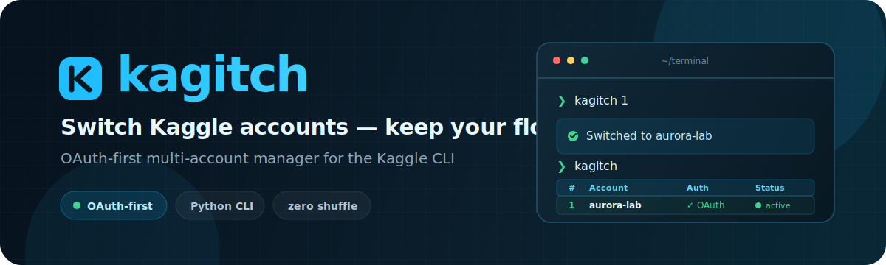

<p align="center">
  
</p>

<p align="center">
  <code>kagitch add</code> · <code>kagitch switch</code> · <code>kagitch check</code>
</p>

---

## Install

```bash
pip install git+https://github.com/TQuang122/Kagitch.git
kagitch init -r  # shell integration (one time)
```

> Requires `pip install kaggle` and Python 3.8+.
>
> **Windows / PowerShell:** `kagitch init` detects `$PROFILE` for both
> PowerShell 5.1 and 7+. Run `kagitch init -r` to print a `. $PROFILE`
> reload command (no `os.execv()` on Windows).

---

## Quick start

```bash
kagitch add work      # OAuth login — opens browser
kagitch add personal  # or: kagitch add personal ~/kaggle.json (legacy key)
kagitch 2             # switch to account 2
kagitch check         # check quota for all accounts
kaggle quota          # kaggle CLI follows the switched account
```

```text
$ kagitch
╭──────────── Dashboard ────────────╮
│  Active  #2 work                  │
│                                    │
│  Run kagitch switch to choose...   │
╰────────────────────────────────────╯
┏━━━┳━━━━━━━━━━┳━━━━━━━━━━┳━━━━━━━━━━━━━━━━┳━━━━━━━━━━┓
┃ # ┃ Name     ┃ Auth     ┃ Path           ┃ Status   ┃
┡━━━╇━━━━━━━━━━╇━━━━━━━━━━╇━━━━━━━━━━━━━━━━╇━━━━━━━━━━┩
│ 1 │ personal │ No creds │ ~/.kaggle      │          │
│ 2 │ work     │ OAuth    │ ~/.kaggle-work │ ● active │
└───┴──────────┴──────────┴────────────────┴──────────┘
```

---

## Commands


| Command                     | Aliases                  | What it does                            |
| --------------------------- | ------------------------ | --------------------------------------- |
| `kagitch`                   |                          | Show dashboard + active account         |
| `kagitch list`              | `ls`                     | List accounts                           |
| `kagitch <N\|name>`         |                          | Switch to account                       |
| `kagitch switch [N\|name]`  |                          | Prompt or switch to account             |
| `kagitch current`           | `cur`, `.`               | Show active account                     |
| `kagitch add <name>`        | `login`                  | Add account via OAuth                   |
| `kagitch add <name> <file>` |                          | Add account via legacy API key          |
| `kagitch remove <N\|name>`  | `rm`                     | Remove an account (deletes credentials) |
| `kagitch rename <N> <name>` |                          | Rename an account                       |
| `kagitch patch [path]`      |                          | Patch `kernel-metadata.json` id         |
| `kagitch check`             |                          | Check quota & auth for all accounts     |
| `kagitch doctor`            |                          | System diagnostics                      |
| `kagitch update`            |                          | Pull latest version from git            |
| `kagitch init [-r]`         |                          | Install / reload shell integration      |
| `kagitch completions <sh>`  |                          | Print shell completion script           |
| `kagitch help`              | `-h`, `--help`           | Show help                               |
| `kagitch version`           | `-v`, `--version`        | Show version                            |


---

## How it works

Each account lives in `~/.kaggle-<name>/`.

The shell wrapper sets `KAGGLE_CONFIG_DIR` when you switch.

**Config stored at:**

```text
~/.config/kagitch/accounts.json
```
