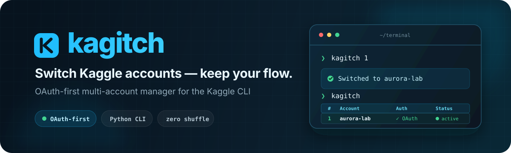

<p align="center">
  
</p>

<p align="center">
  <code>kagitch add</code> · <code>kagitch switch</code> · <code>kagitch check</code>
</p>

---

## Install

```bash
pip install kagitch
kagitch init        # interactive setup wizard (one time)
```

> Requires `pip install kaggle` and Python 3.8+.
>
> **Windows / PowerShell:** `kagitch init` detects `$PROFILE` for both
> PowerShell 5.1 and 7+. Run `kagitch init -r` to print a `. $PROFILE`
> reload command.
>
> **Config path:** `%APPDATA%\kagitch\accounts.json` on Windows,
> `~/.config/kagitch/accounts.json` on Linux/macOS.

---

## Quick start

```bash
kagitch add work      # OAuth login — opens browser
kagitch add personal  # or: kagitch add personal ~/kaggle.json (legacy key)
kagitch 2             # switch to account 2
kagitch check         # check quota for all accounts
kaggle quota          # kaggle CLI follows the switched account
kaggle push kernels -p . # push current folder as a Kaggle kernel
```
```text
$ kagitch

╭─────────────────── Dashboard ───────────────────╮
│   Active  #1 account1                           │
│                                                 │
│   Run kagitch switch to choose another account. │
╰─────────────────────────────────────────────────╯
┏━━━━━┳━━━━━━━━━━━━━━┳━━━━━━━━━━┳━━━━━━━━━━━━━━━━━━━━━━━━━━━━━━┳━━━━━━━━━━┓
┃   # ┃ Name         ┃  Auth    ┃ Path                         ┃ Status   ┃
┡━━━━━╇━━━━━━━━━━━━━━╇━━━━━━━━━━╇━━━━━━━━━━━━━━━━━━━━━━━━━━━━━━╇━━━━━━━━━━┩
│   1 │ account1     │   OAuth  │  ~/.kaggle-account1          │ ● active │
│   2 │ account2     │   OAuth  │  ~/.kaggle-account2          │          │
│   3 │ account3     │   OAuth  │  ~/.kaggle-account3          │          │
└─────┴──────────────┴──────────┴──────────────────────────────┴──────────┘


```

---

## Commands


| Command                     | Aliases                  | What it does                            |
| --------------------------- | ------------------------ | --------------------------------------- |
| `kagitch`                   |                          | Show dashboard + active account         |
| `kagitch list`              | `ls`                     | List accounts                           |
| `kagitch <N\|name>`         |                          | Switch to account                       |
| `kagitch switch [N\|name]`  |                          | Prompt or switch to account             |
| `kagitch current`           | `cur`, `.`               | Show active account                     |
| `kagitch add <name>`        | `login`                  | Add account via OAuth                   |
| `kagitch add <name> <file>` |                          | Add account via legacy API key          |
| `kagitch remove <N\|name>`  | `rm`                     | Remove an account (deletes credentials) |
| `kagitch rename <N> <name>` |                          | Rename an account                       |
| `kagitch patch [path]`      |                          | Patch `kernel-metadata.json` id         |
| `kagitch kernel init`       |                          | Create `kernel-metadata.json` interactively |
| `kagitch kernel logs [kernel]` |                       | Stream kernel logs (interactive browse, follow) |
| `kagitch kernel output [owner/slug]` |                  | Download kernel outputs (interactive tree picker, or `-a` for all) |
| `kagitch kernel push [path]`      |                          | Push kernel from `kernel-metadata.json` (auto-switch account, `--wait`) |
| `kagitch check`             |                          | Check quota & auth for all accounts     |
| `kagitch doctor`            |                          | System diagnostics                      |
| `kagitch update`            |                          | Pull latest version from git            |
| `kagitch init`               |                          | Interactive setup wizard (7 steps)      |
| `kagitch init -r`            |                          | Print shell reload command             |
| `kagitch completions <sh>`  |                          | Print shell completion script           |
| `kagitch help`              | `-h`, `--help`           | Show help                               |
| `kagitch version`           | `-v`, `--version`        | Show version                            |


---

## Kernel commands

```bash
kagitch kernel init                      # create kernel-metadata.json interactively
kagitch kernel logs <owner/slug>         # stream kernel logs (no ref = interactive browse)
kagitch kernel output <owner/slug>       # download outputs: pick files on the tree
kagitch kernel output <owner/slug> -a    # download every output file
kagitch kernel output <owner/slug> -p out -f   # target dir + overwrite existing
kagitch kernel push                      # push kernel from kernel-metadata.json (current dir)
kagitch kernel push -p notebooks/foo     # push from a specific directory
kagitch kernel push --wait               # push and wait for the run to finish
```

`kagitch kernel push` reads `kernel-metadata.json` for the kernel's `owner/slug`, auto-switches
to the owning account, and runs `kaggle kernels push -p <dir>` (default: current directory).
Use `--dry-run` to preview, or `--wait` to poll `kaggle kernels status` every 5s until the run
completes. Requires a `kernel-metadata.json` with an `id` like `owner/slug` — create one with
`kagitch kernel init`.

`kagitch kernel output` shows the kernel's output structure as an interactive tree with
per-file sizes, lets you pick individual files or whole directories (`space` toggles,
`a` selects/deselects all, arrow keys navigate), streams downloads with a live progress
bar, and finishes with a summary card. The kernel picker supports type-to-filter and
color-coded statuses, and the filter prompt (`filter: <query>`) is always visible.
Requires `kaggle>=2.2.4` (bundles `kagglesdk>=0.1.33`).

`kagitch kernel logs` supports `-f, --follow`, `-n <N>`, `--stdout`, `--stderr`,
`--show-progress`, `-e, --errors-only`, `--summary`, `--no-group`, and `-b, --browse`
(interactive picker, no ref needed). `kagitch kernel output` supports `-a, --all`,
`-p, --path DIR` (default `./<slug>-output`), and `-f, --force`.

---

## How it works

Each account lives in `~/.kaggle-<name>/`.

The shell wrapper sets `KAGGLE_CONFIG_DIR` when you switch.

**Config stored at:**
- Windows: `%APPDATA%\kagitch\accounts.json`
- Linux/macOS: `~/.config/kagitch/accounts.json`
